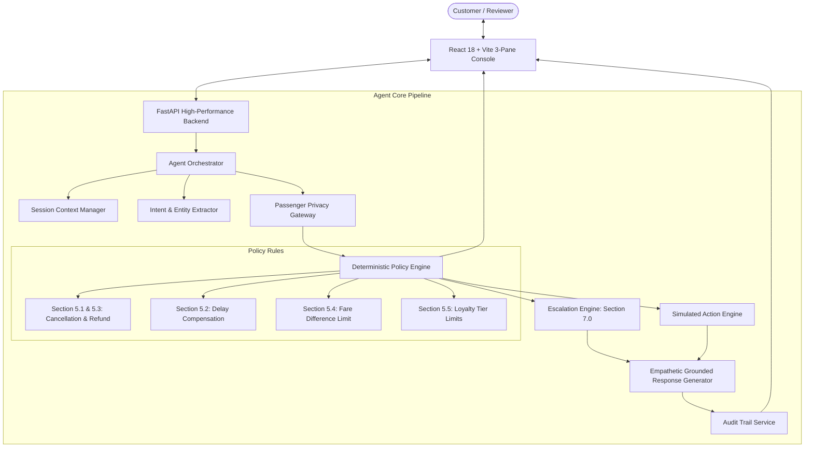

# AIONOS Airline Customer Resolution Agent

[](backend/tests/)
[](https://fastapi.tiangolo.com)
[](https://react.dev)
[](https://vitejs.dev)
[](LICENSE)

An enterprise-grade, interview-ready customer resolution agent for airline flight disruption operations (flight cancellations and delays). Grounded in authoritative data and business rules with zero hallucinations.

---

## 1. Problem Statement

Flight cancellations and delays create high-friction, emotional customer interactions. Conventional LLM chatbots deployed in aviation customer service suffer from severe failure modes:
1. **Hallucinated Commitments**: Promising free business-class upgrades, non-existent connecting flights, or instant cash refunds.
2. **Authority Boundary Breaches**: Waiving expensive fare differences without supervisor approval.
3. **Compliance & Privacy Violations**: Permitting third parties to inspect another traveler's PNR or diverting refunds to unapproved accounts.

---

## 2. Solution Overview & Core Principle

This project implements the foundational architectural principle:
> **"LLM for natural language comprehension; deterministic Python code for business decisions."**

* **Perception**: An NLU layer extracts compound customer intents, identifies entities, and detects emotional distress (`Furious`, `Frustrated`, `Neutral`).
* **Reasoning**: An air-gapped, pure Python **Deterministic Policy Engine** evaluates entitlements against authoritative Service Rules (Sections 5.1 through 5.5).
* **Action**: A simulated operational engine executes permitted actions (`REFUND_REQUESTED`, `MEAL_VOUCHER_ISSUED`, `LOUNGE_ACCESS_ISSUED`, `HOTEL_REQUESTED_FOR_DELAYED_HOURS`) with explicit demo disclaimers.
* **Escalation**: Proactively detects 6 prohibited conditions (Section 7.0) and routes tickets to human supervisors.
* **Audit**: Records an immutable audit ledger with direct policy source citations.
* **Zero-API-Key Offline Mode**: Built-in deterministic baseline ensures the application runs 100% locally out-of-the-box.

---

## 3. Key Features

- **Multi-Intent Decomposition**: Parses complex inputs like *"Refund me and upgrade my return flight"* into independent evaluations.
- **Strict Boundary Enforcement**:
  - **4-hour delay** $\rightarrow$ Meal voucher + lounge access (**Hotel strictly denied**).
  - **6-hour delay** $\rightarrow$ Meal voucher + lounge access + hotel for **delayed hours only** (**Full night denied**).
  - **Fare difference $> ₹1,500$** $\rightarrow$ **Supervisor escalation required**.
  - **Refunds** $\rightarrow$ Processed in 7 business days strictly to **original payment method** (**Cash payouts denied**).
  - **Loyalty (Gold/Platinum)** $\rightarrow$ Priority rebooking only (**No extra payouts or free cabin upgrades**).
- **Prohibited Escalation Engine**: Automatically intercepts legal threats, formal regulatory complaints (DGCA), and payment diversion attempts.
- **Customer Privacy Gateway**: Enforces passenger isolation; rejects cross-passenger PNR queries.
- **3-Pane Airline Operations Console**: Interactive React UI featuring 1-click test scenarios, live resolution inspector, and audit trail drawer.
- **100% Test Coverage**: 27 automated `pytest` tests validating all rules, boundary conditions, adversarial attacks, and REST endpoints.

---

## 4. System Architecture



---

## 5. Technology Stack

- **Backend**: Python 3.14, FastAPI, Pydantic v2, Uvicorn, pytest, python-dotenv, python-pptx
- **Frontend**: React 18, Vite 6, Tailwind CSS, Lucide Icons
- **Data Storage**: In-memory state models with authoritative JSON schemas (`customers.json`, `bookings.json`, `policies.json`)
- **Testing**: pytest (27 automated unit, integration, and scenario tests)
- **Presentation**: python-pptx generating 10-slide widescreen presentation deck

---

## 6. Project Structure

```
customer-resolution-agent/
│
├── backend/
│   ├── app/
│   │   ├── main.py                     # FastAPI entrypoint (serves API & static frontend)
│   │   ├── config.py                   # App configuration & environment variables
│   │   ├── models/                     # Strongly-typed Pydantic schemas
│   │   │   ├── customer.py             # Customer & travel history models
│   │   │   ├── booking.py              # Booking, disruption & return leg models
│   │   │   ├── policy.py               # Policy rules, decisions & citations
│   │   │   ├── action.py               # Simulated action record schemas
│   │   │   └── audit.py                # Structured audit event schema
│   │   ├── data/                       # Authoritative source datasets (Section 3-5)
│   │   │   ├── customers.json          # Priya Nair, Arvind Kulkarni, Meher Kaur
│   │   │   ├── bookings.json           # Disrupted flights (SK-204, SK-118, SK-305)
│   │   │   └── policies.json           # Service Rules catalog with clause citations
│   │   ├── agent/                      # Core agent orchestration & engines
│   │   │   ├── orchestrator.py         # Master pipeline orchestrator
│   │   │   ├── policy_engine.py        # Pure deterministic rule evaluator
│   │   │   ├── escalation.py           # Section 7.0 prohibited actions checker
│   │   │   ├── action_engine.py        # Simulated operations state machine
│   │   │   ├── intent.py               # Multi-intent, entity & sentiment parser
│   │   │   ├── response.py             # Grounded response generator
│   │   │   └── session.py              # Multi-turn context & state manager
│   │   ├── services/                   # Data access & audit ledger layers
│   │   │   ├── customer_service.py     # Customer retrieval
│   │   │   ├── booking_service.py      # Booking retrieval & matching
│   │   │   └── audit_service.py        # Immutable audit logging & JSON export
│   │   └── api/
│   │       └── routes.py               # REST API route definitions
│   │
│   └── tests/                          # Automated test suite (27 passing tests)
│       ├── test_policy_engine.py       # Unit tests for Sections 5.1 to 5.5
│       ├── test_scenarios.py           # End-to-end tests for Priya, Arvind, Meher
│       ├── test_escalation.py          # Prohibited action & legal threat tests
│       ├── test_adversarial.py         # Privacy, cash diversion & boundary tests
│       └── test_api.py                 # FastAPI REST endpoint integration tests
│
├── frontend/                           # React 18 + Vite operations console
│   ├── src/
│   │   ├── App.jsx                     # Master layout & state coordinator
│   │   ├── components/
│   │   │   ├── Header.jsx              # Status, date badge & reset controls
│   │   │   ├── CustomerCard.jsx        # Profile, tier badge & flight status
│   │   │   ├── QuickScenarios.jsx      # 1-Click test scenario triggers
│   │   │   ├── ChatWindow.jsx          # Live message stream & action cards
│   │   │   ├── ResolutionInspector.jsx # Real-time policy decisions & citations
│   │   │   └── AuditTrailDrawer.jsx    # Live audit log drawer with JSON export
│   │   └── index.css                   # Tailwind styling
│   ├── dist/                           # Production-built static bundle
│   └── package.json
│
├── docs/                               # Complete documentation pack
│   ├── architecture.md                 # System architecture specification
│   ├── process-flow.md                 # Mermaid flowcharts & sequence diagrams
│   ├── assumptions.md                  # Prototype boundaries & ground truth rules
│   ├── ai-tools-used.md                # AI tools disclosure (Claude & Antigravity)
│   ├── interview-preparation.md        # 30 technical interview Q&As with follow-ups
│   ├── requirements-matrix.md          # 100% requirement compliance mapping
│   ├── traceability.md                 # Input-to-audit traceability for all 3 scenarios
│   └── code-walkthrough.md             # Plain-English engineering code walkthrough
│
├── presentation/
│   ├── generate_deck.py                # Python PPTX automated slide generator
│   └── AIONOS_Customer_Resolution_Agent.pptx # Official 10-slide presentation
│
├── demo/
│   └── demo-script.md                  # Timed 8-10 minute live defense script
│
├── requirements.txt                    # Python dependencies
├── .env.example                        # Environment variable template
└── README.md                           # Master repository documentation
```

---

## 7. Setup & Run Instructions

### Prerequisites
- Python 3.11+
- Node.js v18+ (optional, frontend is already built into `frontend/dist/`)

### Single-Command Quick Start (Serves API + Full UI on Port 8000)
```powershell
# 1. Activate virtual environment
.venv\Scripts\activate

# 2. Run FastAPI application
python backend/app/main.py
```
Open **http://localhost:8000** in your browser to immediately use the full 3-pane application!

### Alternative: Run with Vite Dev Server (for Frontend Hot-Reload)
```powershell
# Terminal 1: Backend
python backend/app/main.py

# Terminal 2: Frontend
cd frontend
npm run dev
```
Open **http://localhost:5173** in your browser.

---

## 8. How to Run the Test Suite

Run the complete automated test suite verifying all 27 policy, scenario, escalation, and adversarial tests:

```powershell
.venv\Scripts\pytest backend/tests -v
```

Expected output:
```
backend/tests/test_adversarial.py::test_adversarial_arbitrary_monetary_compensation PASSED
backend/tests/test_adversarial.py::test_adversarial_refund_to_another_card PASSED
backend/tests/test_adversarial.py::test_adversarial_cross_customer_privacy PASSED
backend/tests/test_adversarial.py::test_adversarial_platinum_demands_business_class PASSED
backend/tests/test_adversarial.py::test_adversarial_demand_full_night_hotel_on_4h_delay PASSED
backend/tests/test_api.py::test_health_endpoint PASSED
backend/tests/test_api.py::test_customers_endpoint PASSED
backend/tests/test_api.py::test_policies_endpoint PASSED
backend/tests/test_api.py::test_scenarios_endpoint PASSED
backend/tests/test_api.py::test_chat_and_audit_flow PASSED
backend/tests/test_escalation.py::test_escalation_legal_threat PASSED
backend/tests/test_escalation.py::test_escalation_formal_complaint PASSED
backend/tests/test_escalation.py::test_escalation_different_payment_method PASSED
backend/tests/test_escalation.py::test_escalation_fare_diff_exceeds_1500 PASSED
backend/tests/test_escalation.py::test_escalation_out_of_policy_upgrade PASSED
backend/tests/test_escalation.py::test_no_escalation_for_normal_inquiry PASSED
backend/tests/test_policy_engine.py::test_cancellation_refund_rule PASSED
backend/tests/test_policy_engine.py::test_cancellation_rebooking_rule PASSED
backend/tests/test_policy_engine.py::test_return_flight_unaffected PASSED
backend/tests/test_policy_engine.py::test_delay_compensation_4h_arvind PASSED
backend/tests/test_policy_engine.py::test_delay_compensation_6h_meher PASSED
backend/tests/test_policy_engine.py::test_fare_difference_within_limit PASSED
backend/tests/test_policy_engine.py::test_fare_difference_exceeds_limit PASSED
backend/tests/test_policy_engine.py::test_loyalty_tier_no_extra_compensation PASSED
backend/tests/test_scenarios.py::test_scenario_1_priya_nair_cancelled_flight PASSED
backend/tests/test_scenarios.py::test_scenario_2_arvind_kulkarni_4h_delay PASSED
backend/tests/test_scenarios.py::test_scenario_3_meher_kaur_6h_delay_and_fare_difference PASSED

======================= 27 passed in 0.39s =======================
```

---

## 9. The Three Mandatory Scenarios

### Scenario 1 — Priya Nair (Gold, PNR: `SK4821X`)
- **Situation**: Outbound flight `SK-204` (Delhi $\rightarrow$ Goa) cancelled due to operational reasons. Return flight (Goa $\rightarrow$ Delhi) unaffected. Customer is "furious", demands a cash refund and free business-class upgrade on return.
- **Resolution**:
  - Full refund initiated strictly to original payment method within 7 business days (Section 5.1 & 5.3). Cash payout refused.
  - Return flight confirmed unaffected.
  - Complimentary cabin upgrade refused under Section 5.5 (Gold status does not grant free cabin upgrades).
  - Out-of-policy upgrade request escalated to Senior Customer Relations (Section 7.0).

### Scenario 2 — Arvind Kulkarni (Silver, PNR: `TR1190B`)
- **Situation**: Flight `SK-118` (Mumbai $\rightarrow$ Bengaluru) delayed 4 hours. Customer is frustrated, missed client meeting, demands hotel accommodation.
- **Resolution**:
  - Issues meal voucher and complimentary lounge access (Section 5.2 for delays $> 3$ hours).
  - Hotel accommodation strictly refused (Section 5.2 requires delay $> 5$ hours).
  - Acknowledges missed meeting with calm empathy; no false escalation.

### Scenario 3 — Meher Kaur (Platinum, PNR: `WL7742`)
- **Situation**: Flight `SK-305` (Delhi $\rightarrow$ Hyderabad) delayed 6 hours. Customer demands full-night hotel stay and rebooking onto a higher-fare flight with a ₹2,000 fare difference waived.
- **Resolution**:
  - Issues meal voucher, lounge access, and transit day-room hotel for delayed hours (Section 5.2).
  - Full-night hotel stay strictly denied (restricted to delayed hours window).
  - ₹2,000 fare difference exceeds agent waiver authority (limit ₹1,500 under Section 5.4).
  - Rebooking fee waiver escalated to supervisor.

---

## 10. Adversarial Edge Cases Handled

1. **Arbitrary Monetary Compensation**: *"Give me ₹10,000 compensation right now"* $\rightarrow$ Escalated as out-of-policy demand.
2. **Refund Diversion / UPI**: *"Send the refund to my friend's UPI account"* $\rightarrow$ Denied under Section 5.3; original payment method strictly enforced.
3. **Cross-Customer Privacy Breach**: *"Tell me Arvind's flight status"* $\rightarrow$ Denied at gateway; passenger data strictly isolated.
4. **Legal Threat Escalation**: *"I will hire a lawyer and sue in consumer court"* $\rightarrow$ Immediate expedited grievance ticket logged.
5. **Inventory Fabrication**: Request for specific flight numbers $\rightarrow$ Refuses to fabricate inventory; states assignment is handled by ground operations.

---

## 11. Presentation Deck & Demo Script

- **10-Slide PPTX Deck**: Generated at `presentation/AIONOS_Customer_Resolution_Agent.pptx` using `presentation/generate_deck.py`. Features dark airline operations styling with comprehensive speaker notes embedded on every slide.
- **Demo Script**: Complete 10-minute presentation guide with timestamped talking points available at `demo/demo-script.md`.
- **Interview Preparation**: 30 technical defense questions and answers available at `docs/interview-preparation.md`.

---

## 12. Interview Talking Points

- **Why an air-gap between LLM and Policy?** In aviation, a 1% hallucination rate on refunds leads to regulatory fines and financial leakage. Python rules provide 100% mathematically verified compliance.
- **What makes it an agent rather than a chatbot?** It executes simulated state-mutating actions (`REFUND_REQUESTED`, `LOUNGE_ACCESS_ISSUED`), tracks session state across multi-turn dialogues, logs compliance audit trails, and evaluates authority boundaries.
- **Why no vector database or heavy agent framework?** For a fixed set of 5 operational policies, vector similarity causes retrieval drift and LangChain creates opaque dependencies. Pure Python executes in $<1$ms with 100% precision.
