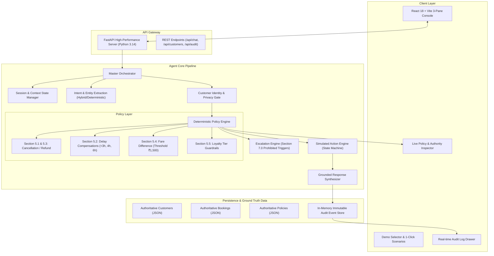

# System Architecture: AIONOS Airline Customer Resolution Agent

## 1. Executive Summary & Architectural Philosophy

The **AIONOS Airline Customer Resolution Agent** is an enterprise-grade agentic resolution system designed for high-stress airline disruption operations (flight cancellations and delays).

### The Golden Rule:
> **"LLM for natural language processing; deterministic code for business decisions."**

In regulated customer-facing operations, allowing an LLM to freely decide monetary refund eligibility, room night authorizations, or fee waivers introduces non-deterministic hallucination risk. This architecture enforces an **air-gap between linguistic comprehension and business logic execution**.

---

## 2. System Component Topology

---

## 3. Detailed Component Breakdown

### 3.1 Frontend Operations Console (React + Vite + Tailwind CSS)
* **3-Pane Operational Interface**:
  * **Left Sidebar**: Customer identity context (Priya Nair, Arvind Kulkarni, Meher Kaur) and 1-click test scenario triggers.
  * **Center Panel**: Conversational stream with emotion badges (`Furious`, `Frustrated`), action cards (`[SIMULATED ACTION: Refund Submitted]`), and escalation tickets.
  * **Right Panel**: Policy Resolution Inspector showing evaluated clauses, active restrictions (`ORIGINAL_PAYMENT_METHOD_ONLY`, `NO_FULL_NIGHT_STAY`), and authority gauges.
  * **Slide-over Drawer**: Full audit trail with instant JSON export.

### 3.2 Hybrid Intent & Entity Extractor (`intent.py`)
* Deconstructs multi-intent compound inputs (e.g. `"I want a refund and a free business-class upgrade"` $\rightarrow$ `["REFUND_REQUEST", "UPGRADE_REQUEST"]`).
* Extracts key entities: PNR tokens (`SK4821X`, `TR1190B`, `WL7742`), flight numbers (`SK-204`, `SK-118`, `SK-305`), and numerical fare differences (`₹2,000`).
* Detects customer sentiment (`Furious`, `Frustrated`, `Neutral`).
* Runs with an embedded **deterministic pattern recognizer** that guarantees 100% offline functionality without external LLM API keys.

### 3.3 Privacy & Data Isolation Gateway
* Ensures zero cross-customer data leakage.
* If a customer attempts to query another passenger's PNR (e.g. Priya asking for Arvind's `TR1190B`), the gateway immediately intercepts the request and responds:
  *"For customer privacy and security regulations, I am only authorized to access and discuss your own confirmed booking."*

### 3.4 Deterministic Policy Engine (`policy_engine.py`)
* Implements authoritative service rules in strongly typed, pure Python code.
* **No LLM prompts** are used to decide whether an action is permitted.
* Returns structured `PolicyDecision` objects containing:
  * `eligible`: boolean flag
  * `allowed_actions`: permitted action identifiers
  * `restrictions`: strict operational guardrails
  * `escalation_required`: boolean indicator
  * `policy_sources`: exact clause citations (`Section 5.1`, `Section 5.2`, etc.)

### 3.5 Escalation Engine (`escalation.py`)
* Enforces the 6 prohibited conditions defined in Section 7.0:
  1. Compensation requested beyond policy.
  2. Fare difference waiver exceeding ₹1,500.
  3. Non-airline caused disruption exceptions.
  4. Legal action threats (e.g., "sue", "lawyer", "consumer court").
  5. Formal regulatory complaints (e.g., "DGCA", "ministry").
  6. Refund to an unauthorized payment method (cash, third-party UPI).
* Generates an escalation ticket (`ESC-TCK-XXXXXX`) and assigns priority.

### 3.6 Simulated Action Engine (`action_engine.py`)
* Manages simulated execution states:
  * `REFUND_REQUESTED` (7 business days SLA, original payment method only).
  * `MEAL_VOUCHER_ISSUED` (Airport dining voucher).
  * `LOUNGE_ACCESS_ISSUED` (Complimentary airport lounge pass).
  * `HOTEL_REQUESTED_FOR_DELAYED_HOURS` (Day-use transit room; strictly NOT full night).
  * `REBOOKING_REQUESTED` (Free 24h rebooking window; ground operations assignment).
  * `ESCALATED_TO_HUMAN` (Supervisor routing).
* Every action is explicitly stamped with:
  `SIMULATED DEMO ACTION — No live external airline GDS/payment system modified.`

### 3.7 Continuous Audit Trail Service (`audit_service.py`)
* Maintains an immutable in-memory ledger of every single conversation turn.
* Logs: `audit_id`, `timestamp`, `session_id`, `customer_id`, `pnr`, `user_message`, `detected_intents`, `detected_sentiment`, `policy_decisions`, `actions_taken`, `escalated`, `policy_citations`, and `agent_response`.
* Provides one-click JSON export for regulatory replay.

---

## 4. Failure Modes & Graceful Degradation

| Failure Mode | Built-in Mitigation |
|---|---|
| **External LLM Outage / Missing API Key** | Embedded deterministic parser operates seamlessly with zero degradation. |
| **Ambiguous Customer Intent** | Agent asks a single clarifying question without repeating known booking facts. |
| **Inventory Fabrication Attempt** | Rebooking engine explicitly notes that flight numbers and seats are assigned by airport ground operations. |
| **Out-of-Authority Waiver Request** | Hard-coded ₹1,500 boundary blocks automated approval and routes to a human supervisor. |
