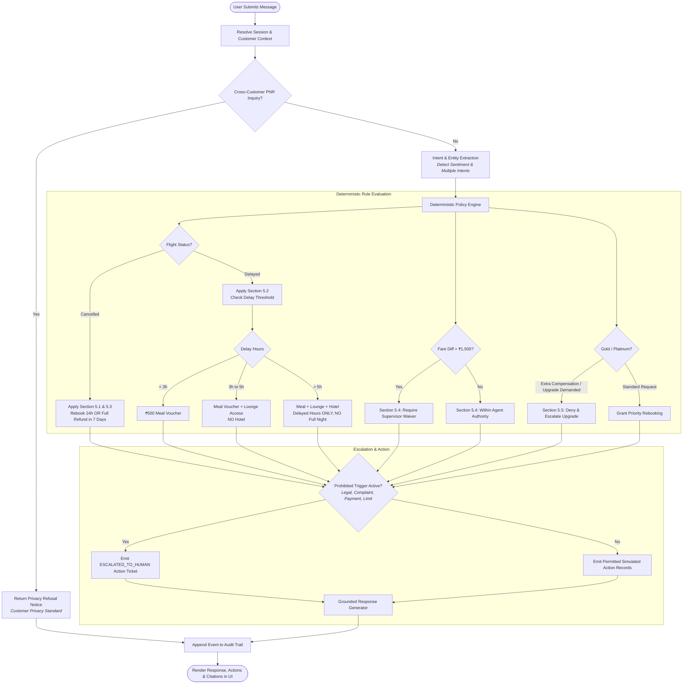
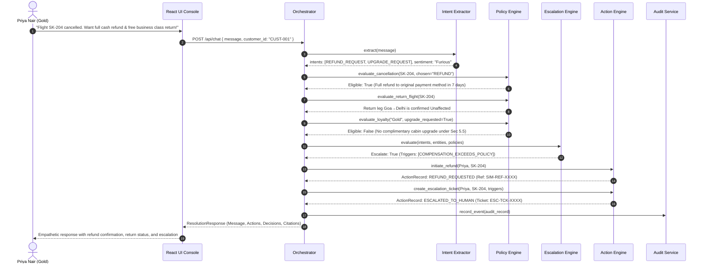
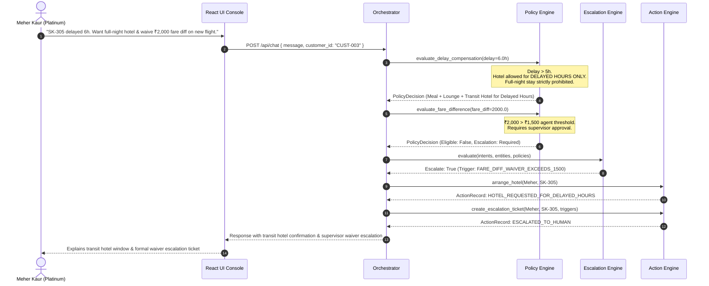

# Process Flow & Sequence Diagrams

## 1. End-to-End Resolution Process Flow

The following flowchart illustrates the step-by-step processing of each customer interaction through the system.



---

## 2. Sequence Diagram: Scenario 1 (Priya Nair — Cancellation & Out-of-Policy Upgrade)



---

## 3. Sequence Diagram: Scenario 2 (Arvind Kulkarni — 4h Delay Boundary Handling)

```mermaid
sequenceDiagram
    autonumber
    actor Arvind as Arvind Kulkarni (Silver)
    participant UI as React UI Console
    participant Orch as Orchestrator
    participant Policy as Policy Engine
    participant Action as Action Engine

    Arvind->>UI: "SK-118 delayed 4h. Missed client meeting. Need hotel room now."
    UI->>Orch: POST /api/chat { message, customer_id: "CUST-002" }
    
    Orch->>Policy: evaluate_delay_compensation(delay=4.0h)
    Note over Policy: Delay > 3h and <= 5h.<br/>Eligible: Meal voucher + Lounge.<br/>Prohibited: Hotel (<5h threshold).
    Policy-->>Orch: PolicyDecision (Meal + Lounge Eligible; Hotel Ineligible)
    
    Orch->>Action: issue_meal_voucher(Arvind, SK-118)
    Action-->>Orch: ActionRecord: MEAL_VOUCHER_ISSUED
    Orch->>Action: issue_lounge_access(Arvind, SK-118)
    Action-->>Orch: ActionRecord: LOUNGE_ACCESS_ISSUED
    
    Note over Orch: No escalation triggered.<br/>Frustration handled with calm empathy.
    Orch-->>UI: Response explaining 4h entitlement and denying hotel under Section 5.2
    UI-->>Arvind: Displays meal voucher code, lounge pass, and hotel explanation
```

---

## 4. Sequence Diagram: Scenario 3 (Meher Kaur — 6h Delay & ₹2,000 Fare Difference)


